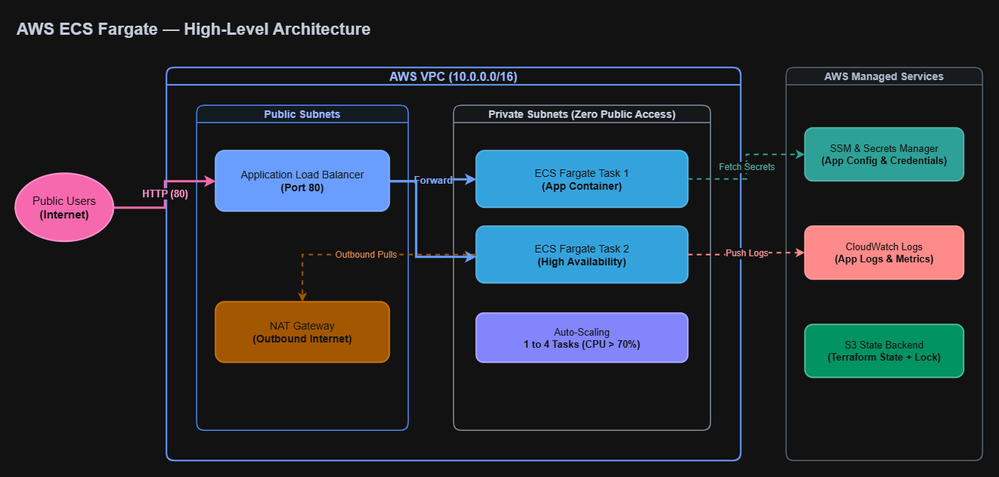

# Enterprise AWS ECS Fargate Platform with Terraform

[](#automated-testing)
[](#architecture-overview)
[](#key-features)
[](#remote-state-management)

A production-grade, modular Infrastructure as Code (IaC) platform provisioning a zero-trust, highly available AWS ECS Fargate environment using Terraform `>= 1.10.0`.

---

## Architecture Overview

The platform provisions a multi-AZ perimeter in `us-east-1`, isolating compute workloads inside private subnets behind a public Application Load Balancer with dynamic autoscaling and decoupled IAM identities.



### Ingress & Traffic Flow
1. **Public Users** access the Application Load Balancer on port 80 across multi-AZ public subnets.
2. **The ALB** routes traffic and performs active HTTP health checks (`GET /`) against registered targets using `target_type = "ip"`.
3. **Fargate Tasks** run strictly in private subnets with **no public IPs**. Network ingress is restricted exclusively to traffic originating from the ALB security group.
4. **Outbound connectivity** for pulling container images and communicating with AWS APIs is routed securely via a NAT Gateway.

---

## Key Features

* **Zero-Trust Network Perimeter:** Direct internet access to containers is blocked; security groups enforce an ALB-only entry point.
* **Separation of IAM Roles:** 
  * `Task Execution Role`: Used strictly by the AWS Fargate agent to stream CloudWatch logs, pull images, and decrypt SSM/Secrets Manager values.
  * `Task Role`: Dedicated runtime identity for containerized application code enforcing least privilege.
* **Dynamic Target Tracking Autoscaling:** Automatically scales containers between **1 and 4 tasks** when average CPU utilization crosses 70%.
* **Drift Protection:** Configured with `lifecycle { ignore_changes = [desired_count] }` to prevent Terraform from reverting active autoscaling adjustments during deployments.
* **Native Remote State Locking:** State is secured in an encrypted S3 bucket using Terraform's native S3 state locking (`use_lockfile = true`).
* **Shift-Left Automated Testing:** Enforces architectural compliance prior to provisioning using native Terraform testing (`terraform test`).

---

## Module Structure

```text
ecs-fargate-platform/
├── modules/
│   ├── vpc/             # Multi-AZ VPC, IGW, NAT Gateway, Public/Private Route Tables
│   ├── alb/             # Application Load Balancer, Ingress Security Groups, Target Group
│   └── ecs/             # ECS Cluster, Task Definitions, Autoscaling, IAM Roles & CloudWatch
├── tests/
│   ├── 01_networking.tftest.hcl        # Validates subnet counts and CIDR ranges
│   ├── 02_alb_security.tftest.hcl      # Validates target_type = "ip" and security groups
│   ├── 03_ecs_configuration.tftest.hcl # Validates cluster and service naming conventions
│   └── 04_autoscaling.tftest.hcl       # Validates service auto-scaling target wiring
├── providers.tf         # S3 remote backend & required AWS/random providers
├── main.tf              # Root module orchestration
├── variables.tf         # Project inputs and region declarations
├── outputs.tf           # Exposed endpoints (ALB DNS URL)
└── architecture.png     # Rendered architecture diagram
